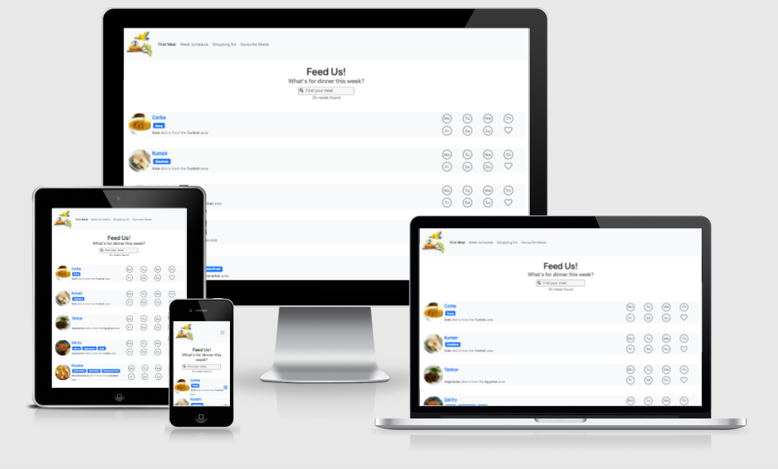

# Feed us website

The site that helps you and your family plan the dinner for the week including shopping list management.



## UX

The typical website user is an adult ready to take the responsabillity to plan the dinner for the whole week.

List user Stories:

- As a user, I would like to see my weekly dinner planning so I can get a dinner overview of whats up for dinner.
- As a user, I would like to find a recepie and add it to the week planning so that I can get an week overview of what is for dinner.
- As a user, I would like to get an automated shopping list based on my weekly schedule, so I know what to buy in the store.
- As a user, I should be able to add items to the shoppinglist so I dont miss buying other items in the store.
- As a user, I should be able to tick off items when Im in the store so I know what I have left to find.
- As a user, I would like to send my shopping list as an email to my fellow, so I dont have todo all shopping myself.
- ...

### Navigation & Wireframes

The website contains a clear navigation on every page.
The site is based on a navigational hierarchical tree structure.
Navigation bar is responsive and will fold down to a burger menu when it wont fit the size.

- [Entry page](wireframes/index.png) that suggests dish and is also the [search dish result page](wireframes/search-results.png)
- [Weekly schedule Page](wireframes/week.png) showing the dishes selected for each day.
- [Favourites Page](wireframes/favourites.png) showing the current favourite dishes.
- [Shopping list Page](wireframes/list.png) showing the current shopping list with email possabillity

### Data storage

In order to track anonymous user we track users with a [fingerprint](https://github.com/fingerprintjs/fingerprintjs) and store the user data with [Google Firebase](https://firebase.google.com/docs/web/setup#from-the-cdn).

Here is an example user record stored on [Google Firebase](https://firebase.google.com/docs/web/setup#from-the-cdn).

```
{
  "data": {
    "meals": {
      "Mon": "52771",
      "Tue": "123",
      "Wed": "123"  ,
      "Thu": "123",
      "Fri": null,
      "Sat": null,
      "Sun": "123"
     },
     "additionalItems": ["1 x Toiletpaper", "2 x lollipops"],
     "favlist": [mealobject,mealobject],
     "shoppingChecked": [itemObject,itemObject]
   },
 }
```

## Features

### Existing Features

- [Browse meals](wireframes/browse-meals.png) - allows user to to find a recepie by searching for a dish by using the query filed.
- [Dinner planning](wireframes/planning.png) - allows user to get a dinner overview by draging dishes between days.
- [Shopping list](wireframes/shoppinglist.png) - Allows user to establish a shopping list where additional item can be added.
- [Meals details page](wireframes/meal.png) - let the user see the recepie details for the meal.
- Feature 1 - allows users X to achieve Y, by having them fill out Z
- ...

### Features Left to Implement

- Use social logins to use the custom data site on multiple devices.
- ...

## Technologies Used

In this section, all of the languages, frameworks, libraries, and any other tools that is used to construct this project is listed with its name, a link to its official site and a short sentence of why it was used.

- [HTML](#)
  - Used to render the DOM
- [CSS](#)
  - Used to layout the site.
- [Javascript](#)
  - Used to handle site code logic and API integrations
- [Bootstrap](https://getbootstrap.com/docs/5.0/getting-started/introduction/)
  - used to make site responsive
- [Fontawesome](https://fontawesome.com/)
  - Used to display icons on website
- [themealdb](https://www.themealdb.com/api.php)
  - Used as recepie database
- [JQuery](https://jquery.com)
  - The project uses **JQuery** to simplify DOM manipulation.
- [Google Firebase](https://firebase.google.com/docs/web/setup#from-the-cdn)
  - Used to store and recall user data
  - https://console.firebase.google.com/project/neon-research-304412/overview
- [Google Cloud Translation](https://cloud.google.com/translate/docs/basic/quickstart)
  - Used to translate recepies
- [Yarn](https://yarnpkg.com/)
  - Used to start dev environment
- [fingerprintjs](https://github.com/fingerprintjs/fingerprintjs)
  - is used to create a browser fingerprint without the user actually login.
- ...

## Testing

[Testing with Jasmine](https://jasmine.github.io/pages/getting_started.html)

In this section, you need to convince the assessor that you have conducted enough testing to legitimately believe that the site works well. Essentially, in this part you will want to go over all of your user stories from the UX section and ensure that they all work as intended, with the project providing an easy and straightforward way for the users to achieve their goals.

Whenever it is feasible, prefer to automate your tests, and if you've done so, provide a brief explanation of your approach, link to the test file(s) and explain how to run them.

For any scenarios that have not been automated, test the user stories manually and provide as much detail as is relevant. A particularly useful form for describing your testing process is via scenarios, such as:

1. Contact form:
   1. Go to the "Contact Us" page
   2. Try to submit the empty form and verify that an error message about the required fields appears
   3. Try to submit the form with an invalid email address and verify that a relevant error message appears
   4. Try to submit the form with all inputs valid and verify that a success message appears.

In addition, you should mention in this section how your project looks and works on different browsers and screen sizes.

You should also mention in this section any interesting bugs or problems you discovered during your testing, even if you haven't addressed them yet.

If this section grows too long, you may want to split it off into a separate file and link to it from here.

### Known Bugs

1. [themealdb](https://www.themealdb.com/api.php) is case sensetive in ingredients that means that "eggs" and "Eggs" will show up twice in the shopping list.
2. ...

## Deployment

Site is deployed to [malmgrenola.github.com/feed-us](https://malmgrenola.github.com/feed-us) using Github Pages.

Deploy by:

1. Fork the [feed-us repo](https://github.com/malmgrenola/feed-us)
2. In the terminal run `git clone https://github.com/{your-own-gituser-here}/feed-us.git` - to fetch code
3. In the terminal run `cd feed-us` - to place yourself in the root of the project.
4. In the terminal run `yarn` - to download all dependencies
5. commit your changes to your forked repo
6. in a terminal run `yarn deploy` - to fire deploy script to Google Pages with custom root folder.

If deployed to anything other than [malmgrenola.github.com/feed-us](https://malmgrenola.github.com/feed-us) you must create your own instances of Google Firebase with your own api keys provided in the [firebase-api.js](https://github.com/malmgrenola/feed-us/blob/main/static/assets/js/firebase-api.js#L2) config section. Full [guideline documentation](https://cloud.google.com/firestore/docs/client/get-firebase) is provided by Google

## Development

This project uses `yarn` to start development server.

1. Fork the [feed-us repo](https://github.com/malmgrenola/feed-us)
2. In the terminal run `git clone https://github.com/{your-own-gituser-here}/feed-us.git` - to fetch code
3. In the terminal run `cd feed-us` - to place yourself in the root of the project.
4. In the terminal run `yarn` - to download all dependencies
5. `yarn dev` - to start dev environment.

a http-server should start on port 3000 and site is now be available on `http://localhost:3000`.  
Google API's used is locked to `localhost:3000` & deploy url `malmgrenola.github.com/feed-us`.  
To change default port please update in `package.json` under scripts section. Please note that changing port will disable the usage of google api key provided in the project.

## Credits

### Content

- The text for section Y was copied from the [Wikipedia article Z](https://en.wikipedia.org/wiki/Z)

### Media

- The photos used in this site were obtained from ...
- https://www.vecteezy.com/vector-art/297563-bird-feeding-baby-bird

### Acknowledgements

- I received inspiration for multilanguage from https://stackoverflow.com/questions/46008760/how-to-build-multiple-language-website-using-pure-html-js-jquery
- I received inspiration for drag and drop from https://mdbootstrap.com/docs/standard/plugins/drag-and-drop/
- https://www.allrecipes.com/
- https://www.simplyrecipes.com/
- https://www.freepik.com/premium-vector/weekly-planner-template-with-floral-watercolor_5643584.htm
- I received inspiration for loading images from [Creating a CSS Animated Loading Card](https://dev.to/chris__sev/creating-a-css-animated-loading-card-5187)
- I received inspiration for [Styling a Search Bar from mikedane website](https://www.mikedane.com/web-development/css/styling-search-bar/)
